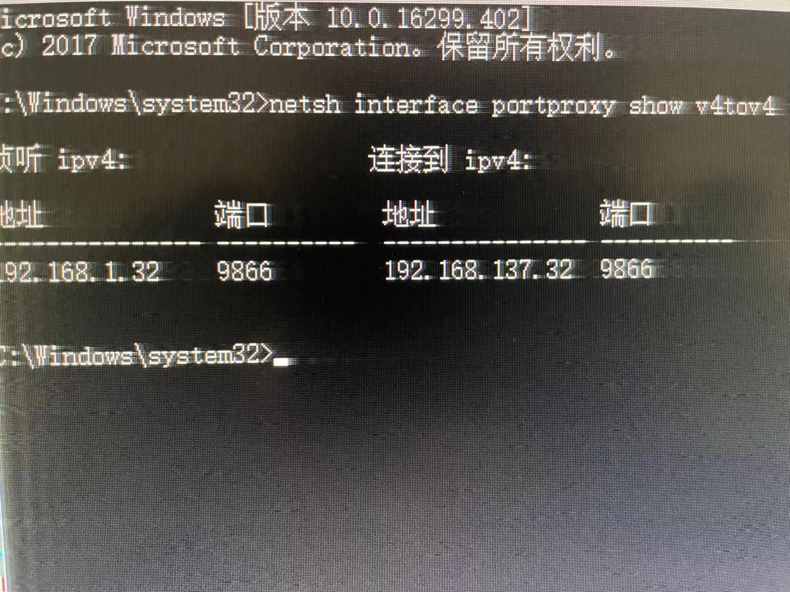
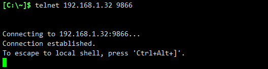

# windows ip端口映射

>  当前场景：需要将本机端口号:8888，映射至其他主机的3389端口，当访问本机ip : 8888时候，会自动转发至其他主机ip : 3389

## 1. 配置映射

在windows 打开命令控制行[CMD](https://so.csdn.net/so/search?q=CMD&spm=1001.2101.3001.7020),然后输入以下命令

> **netsh interface portproxy add v4tov4 listenaddress=本机ip listenport=本机端口 connectaddress=映射ip connectport=映射端口**

## 2.查看映射

在windows 打开命令控制行CMD,然后输入以下命令

> **netsh interface portproxy show v4tov4**

## 3.删除映射

在windows 打开命令控制行CMD,然后输入以下命令

> **netsh interface portproxy delete v4tov4 listenaddress=本机ip listenport=本机端口号**

## 理  解

在台式机的虚拟机上搭建了大数据集群，虚拟机上的ip与宿主机ip不在同一个网段，虽然宿主机能访问虚拟机上的集群各ip 及端口，但是外部却不能访问。**因此，需要将虚拟机上的集群各ip端口，映射到宿主机上的某个端口上，以此对外部提供访问。**

例如：宿主机ip为 192.168.1.32

​	     hadoop maser ip ：192.168.137.31

将master的9866号端口映射到宿主机9866上。

> **netsh interface portproxy add v4tov4 listenaddress=192.168.1.32 listenport=9866 connectaddress=192.168.137.31  connectport=9866**

查看：

测试访问（笔记本）：

