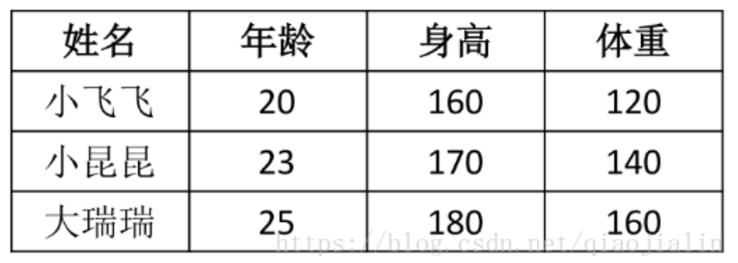
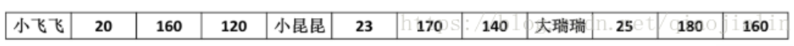
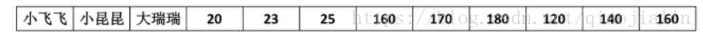

# 列式存储简介

###业务背景

关系表结构是被人们普遍接受的数据模型，通常一行数据由多个属性组成，每个属性是一列。但是磁盘是一维的，文件只能顺序写，那么先写谁后写谁呢？不同的写文件顺序就对应了不同的存储模型。传统数据库通常采用行式存储，即先存一行数据，再存下一行数据。

在大数据时代，一个常见分析型场景是在数据仓库中进行分析，如商店的商品信息，有商品号，进货日期，价格等包含多个属性，这就是一个很常见的数据模型。而查询很多时候是计算某个属性上的聚合值，比如计算一个地区的平均身高，所有人的平均年龄等。列式存储通常将不同数据的同一个属性值存在一起，在查询时只遍历需要的数据。因为每一个属性在表中就是一列，所以很直观的就叫列式存储。（**东哥曾经很流氓的跟我说，你把表转过来看，其实行式存储也是列式存储。。。**）

针对这种场景，但不仅限于这种场景，出现了很多列式存储的文件格式和存储系统，比如 Parquet，CarbonData，Cassandra等。并且在大数据时代的分析型场景下碾压了传统的关系型数据库，于是提出了新名词 NoSQL，Not only SQL，不仅仅是SQL，本意是去掉关系数据库中对事务的支持，在大数据场景事务的概念太重了。

采用行式存储时，数据在磁盘上的组织结构是：

有啥好处呢，假如你想查一个人的所有属性，可以通过一次磁盘 seek 加顺序读取就可以了。但是当我只想查所有人的年龄时，需要不停的seek、seek，或者将所有数据扫描一遍，遍历了很多没用的数据。

采用列式存储时，数据在磁盘上的组织结构是：

这时，当我想查所有人的年龄，这样我只用一次磁盘 seek 加顺序读取所有人的年龄字段就可以了。

#####列式存储、查询引擎

列式存储只是一个很宽泛的概念，将各个属性维度的数据存在一起，这只是一种存储格式，或者说文件的组织方式。但是仅仅有存储格式是不足以实现一个列存系统的。为了继续细化到执行层面，将其丰富成一个系统。还需要有相应的写入流程和查询流程与之对应，在这个过程中就大有可为了。

#####压缩

在定义表的时候，每一列都是一种数据类型，这样就可以使用针对数据类型的压缩方法将数据压缩，压缩可以达到一个数量级的性能提升。当某一列被排序之后，可以达到更高的压缩比。压缩的意义不仅在于降低磁盘占用，毕竟磁盘越来越便宜，这个意义会越来越小。压缩的意义更多在于加速查询，如减少了磁盘IO，或者直接操作压缩后的数据来降低 CPU 代价。

#####拼接

这个刚开始不能说是优点，应该是必须解决的问题。将数据按列存储是很好，但是有一个必须要解决的问题，那就是一个数据项的多个属性被分开存放在不同地方了，一个查询也会同时访问多个属性，并且 JDBC 等接口还是以一行为单位返回结果的。因此，多列数据拼接在列式存储中是一个必不可少的操作。

第一个问题是，怎么拼接？

一个数据项的各个属性分开放了，我怎么知道谁对应谁？一般来说，是按顺序拼接的。比如，第一个数据项的三个属性在三个列的位置都是1，以此类推。

读的时候可以根据下标将各属性拼接起来。

第二个问题是，什么时候拼接？

如果说拼接刚开始只是列式存储不得不解决的问题，那么延迟拼接则应该是列式存储为了解决拼接问题而发掘出来的优势了。

假如一个表里有100列，有一个查询 select c3 from table1 where c1>10 and c2>5

第一种方式是行式过滤的思想，先将c1,c2,c3 三列读出来，拼接成一个一个数据项，再对每行数据项的 c1,c2 的值进行 c1>10 and c2>5 的过滤。这个暂且叫预先拼接。

第二种方式是延迟拼接，将谓词下推至各个列，先记录 c1 列中满足 c1>10 的所有数据下标 A，再记录 c2 列中满足 c2>5 的所有数据下标 B，将 A 和 B 合并成 C，并用 C 去读 c3 列。实践证明这种方式更能发挥列式存储的优势。

SQL语句中的谓词就是where语句后的过滤条件，如等于，小于，大于等于。

#####块遍历

这个比较底层了，涉及CPU的指令执行优化等（其实我也不太了解，有个概念就行了~）。行式存储的查询中，需要将每行数据进行需要过滤的属性抽取，并进行过滤操作，负载很重。列式存储中不需要属性抽取，可以直接将一列的一段数据当做一个数组交给一个 filter，遍历数组的代价比对每个对象进行遍历负载要轻，并且可以利用CPU的并行能力。

行存和列存只是不同的维度而已，没有天生的优劣（打自己脸：列存天生适合压缩）。大数据时代大部分的查询模式决定了列式存储优于行式存储。一般来说，列式存储不仅包括数据是按列存在磁盘上的，还包括针对这种格式的存储和查询引擎。关于列式存储就介绍这么多，有兴趣可以再去看看 Parquet、CarbonData。
————————————————
版权声明：本文为CSDN博主「铁头乔」的原创文章，遵循CC 4.0 BY-SA版权协议，转载请附上原文出处链接及本声明。
原文链接：https://blog.csdn.net/qiaojialin/article/details/81032232