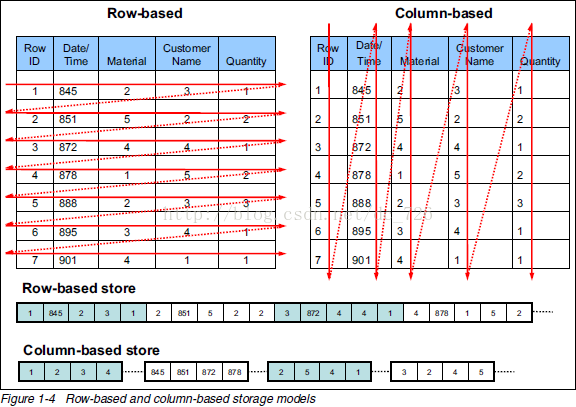
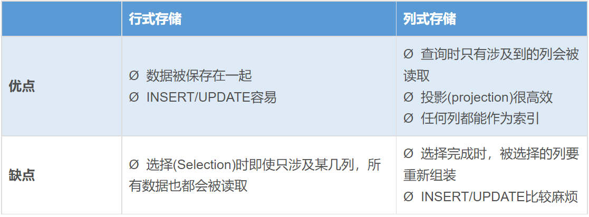
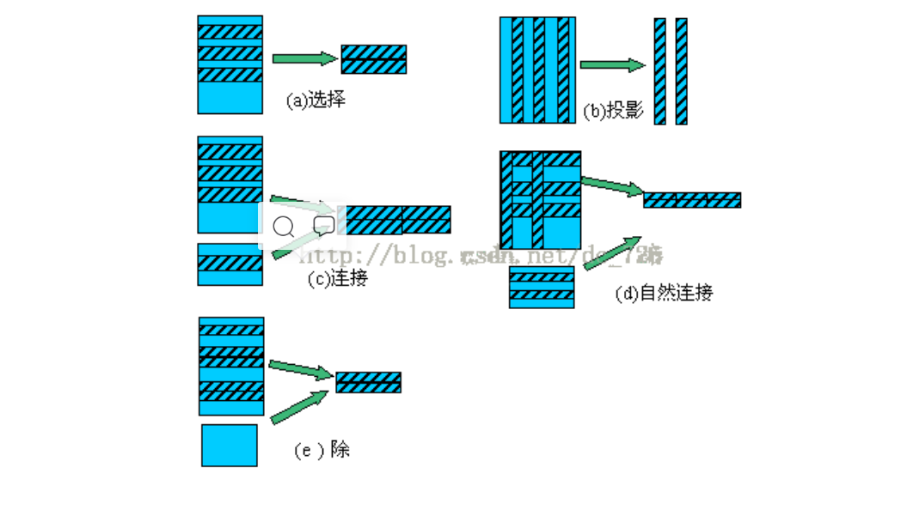
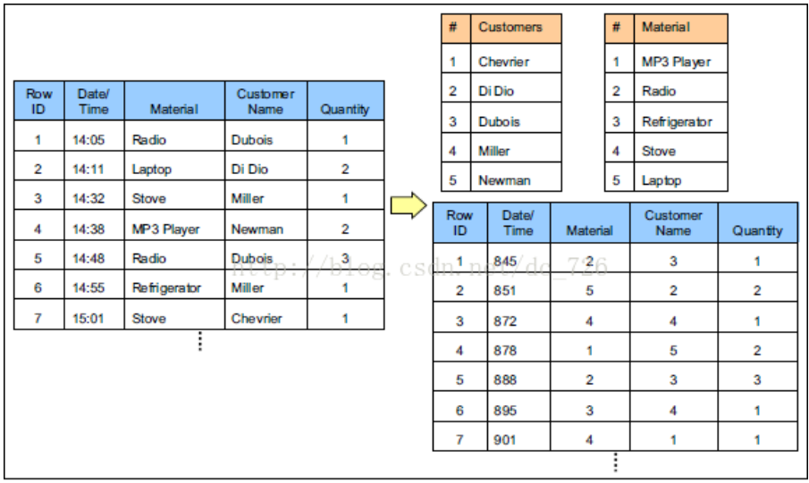
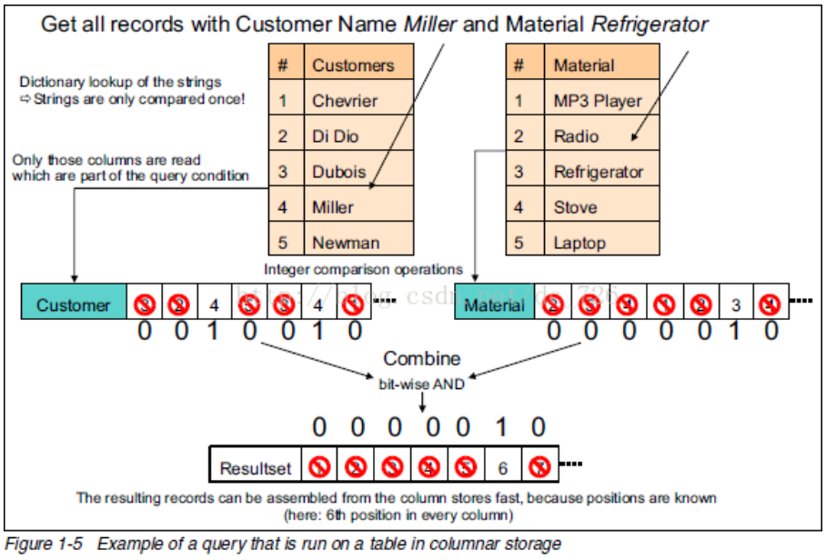

# 几张图看懂列式存储

[原文]([(177条消息) 几张图看懂列式存储_cdai的博客-CSDN博客_列式存储](https://blog.csdn.net/dc_726/article/details/41143175))

最近看到一篇很好资料，里面三言两语配上几个图就把列式存储(Column-based Storage)讲明白了，牛啊！最喜欢的就是这种浅显易懂就把背景知识讲得明明白白，而不是长篇大论的讲概念。

###**1. 为什么要按列存储**

列式存储(Columnar or column-based)是相对于传统关系型数据库的行式存储(Row-basedstorage)来说的。简单来说两者的区别就是如何组织表(翻译不好，直接抄原文了)：

Ø  Row-based storage stores atable in a sequence of rows.

Ø  Column-based storage storesa table in a sequence of columns.

 

从上图可以很清楚地看到，行式存储下一张表的数据都是放在一起的，但列式存储下都被分开保存了。所以它们就有了如下这些优缺点：

*注：关系型数据库理论回顾 - 选择(Selection)和投影(Projection)*

## 2.补充：数据压缩

刚才其实跳过了资料里提到的另一种技术：通过字典表压缩数据。为了方面后面的讲解，这部分也顺带提一下了。

下面中才是那张表本来的样子。经过字典表进行数据压缩后，表中的字符串才都变成数字了。正因为每个字符串在字典表里只出现一次了，所以达到了压缩的目的(有点像规范化和非规范化Normalize和Denomalize)

## 3.查询执行性能

下面就是最牛的图了，通过一条查询的执行过程说明列式存储(以及数据压缩)的优点：

关键步骤如下：

1.     去字典表里找到字符串对应数字(只进行一次字符串比较)。

2.     用数字去列表里匹配，匹配上的位置设为1。

3.     把不同列的匹配结果进行位运算得到符合所有条件的记录下标。

4.     使用这个下标组装出最终的结果集。